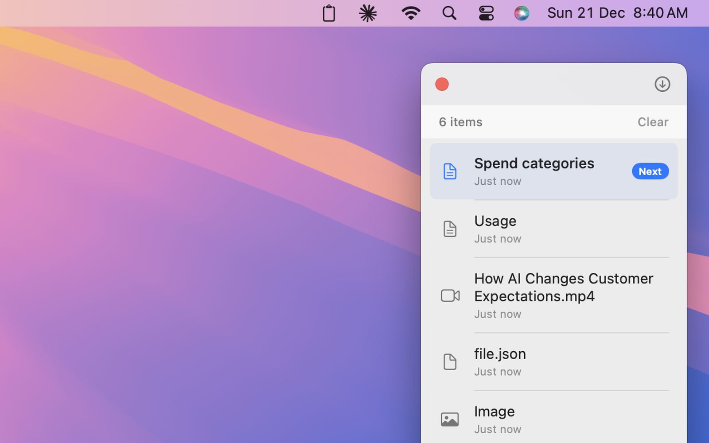

# CopyStack

A macOS menu bar app for **sequential clipboard management**. Instead of keeping a
searchable history like a traditional clipboard manager, CopyStack lets you *collect*
several items in order and then *paste them back one at a time* — each item is removed
from the stack as it's pasted.

It's built for the everyday "copy a few things from over here, paste them over there in
order" task: filling a form from scattered sources, assembling code snippets, or moving
a list of values between two apps without ping-ponging back and forth.



## How it works

```
Cmd+Shift+C            copy the selection AND open the floating stack window
   │                   (clipboard monitoring runs only while this window is open)
   ▼
copy more items …      each copy is captured, typed, and added to the stack
   │
   ▼
Cmd+V, Cmd+V, …        paste the next item in sequence; it's removed as it goes
```

1. **Collect** — `Cmd+Shift+C` copies the current selection and opens a small floating
   window listing the stack. While that window is open, anything you copy is added.
2. **Paste in order** — `Cmd+V` pastes the next item and advances the stack. When the
   stack is empty, `Cmd+V` behaves like a normal paste.
3. **Choose the order** — the stack can grow LIFO (newest pastes first) or FIFO (oldest
   pastes first), switchable in Settings.

Each captured item is typed as text, image, video, file, or web URL, detected in that
priority order. Videos keep their raw pasteboard data so they re-paste correctly into
apps like WhatsApp and Slack.

## Features

- Sequential, stack-based paste — items auto-remove after pasting
- Captures text, images, videos, files, and web URLs
- LIFO or FIFO paste order
- Customizable copy shortcut
- Lightweight menu bar app (no Dock icon); clipboard polling runs only while the stack is open
- Optional copy/paste sound effects
- Built-in "Check for Updates" via GitHub Releases

## Requirements

- macOS 13.0 (Ventura) or later — Apple Silicon or Intel
- **Accessibility permission** (System Settings ▸ Privacy & Security ▸ Accessibility),
  required because the app simulates `Cmd+C` / `Cmd+V`

## Install

1. Download `CopyStack.dmg` from the [Releases](https://github.com/ankitaggarwal/getcopystack.xyz/releases) page.
2. Open the DMG and drag **CopyStack** into your **Applications** folder.
3. Launch CopyStack and grant **Accessibility permission** when prompted
   (System Settings ▸ Privacy & Security ▸ Accessibility) — required so CopyStack
   can simulate `Cmd+C` / `Cmd+V`.

Releases are Developer ID-signed and notarized by Apple, so they open normally on
first launch.

### Troubleshooting: the Accessibility prompt keeps coming back

If CopyStack is enabled in System Settings ▸ Privacy & Security ▸ Accessibility but
still asks for the permission, macOS kept a stale permission entry from a previous
version of the app (the entry is tied to the old build's code signature, so the
checkbox has no effect). CopyStack detects this and offers a **Reset Permission**
button that fixes it in place. To do it manually instead:

```sh
tccutil reset Accessibility com.copystack.app
```

then relaunch CopyStack and grant the permission when the system dialog reappears.
Old entries named "CopyStack" from earlier versions can be removed in System
Settings with the **−** button.

## Build & run

1. Open `Copy Stack.xcodeproj` in Xcode.
2. In the **Copy Stack** target ▸ *Signing & Capabilities*, select your own team
   (the committed project intentionally ships with an empty `DEVELOPMENT_TEAM`).
3. Press ⌘R. The app appears in the menu bar.
4. Grant Accessibility permission when prompted.

To package a signed, distributable DMG, see [`build-release.sh`](build-release.sh).

## Documentation

- [`PRD.md`](PRD.md) — the original product requirements document (vision, personas,
  use cases, requirements, success metrics).
- [`ARCHITECTURE.md`](ARCHITECTURE.md) — how the app is structured and why.

## License

[MIT](LICENSE)
